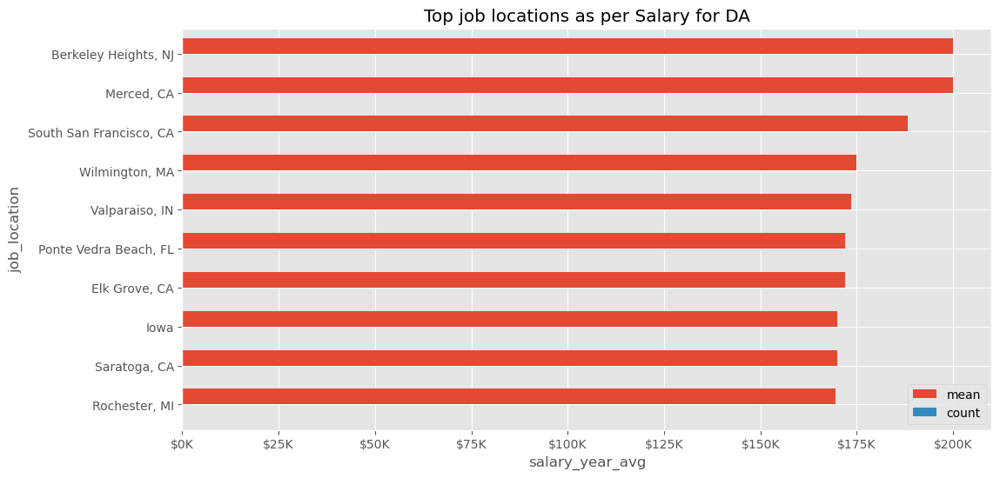
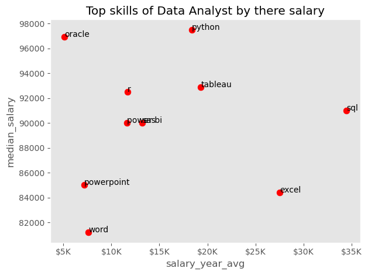
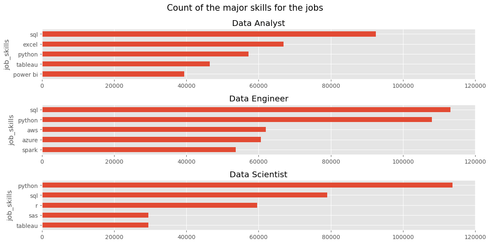
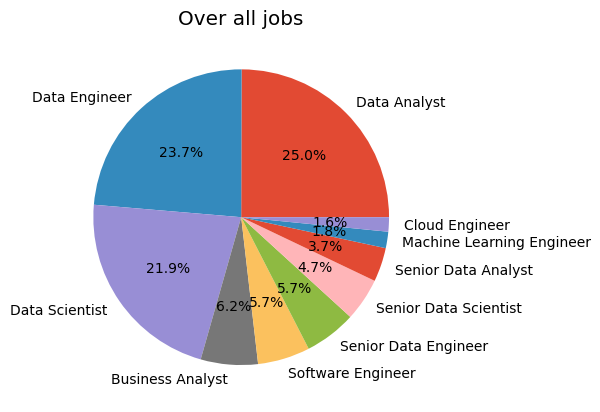
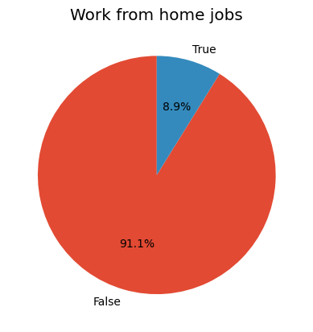
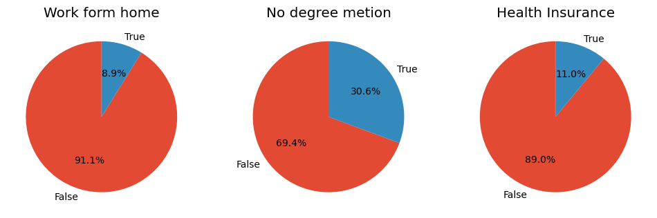
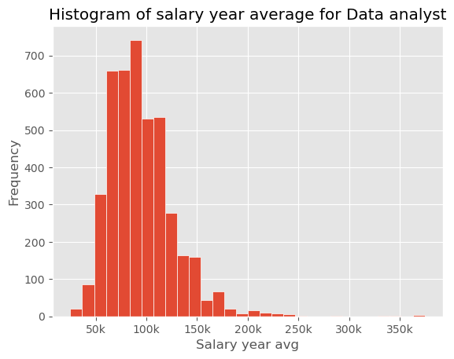
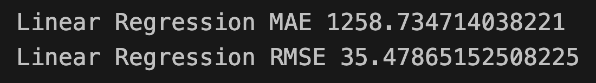

# ---Job Data Analysis using Python---

# 🙏 Introduction

### Data Analysis on Job Search Data

This project involves a comprehensive analysis of job search data using Python. The objective was to explore, visualize, and model the data to gain insights into the job market, identify trends, and compare the performance of different machine learning models. The analysis was performed using a combination of data manipulation, statistical analysis, and machine learning techniques.

# ⚙️ Tools and Libraries Used

- **Pandas**: For data manipulation and analysis.
- **NumPy**: For numerical computations.
- **Matplotlib**: For data visualization.
- **ggplot**: For enhanced data visualization.
- **Scikit-learn**: For implementing machine learning models, specifically Linear Regression and Random Forest Regression.

# 📚 Methodology

1. **Data Cleaning and Preprocessing**:

   - Loaded the job search data using pandas.
   - Cleaned the data by handling missing values and outliers.
   - Performed feature engineering to create new relevant features.

2. **Exploratory Data Analysis (EDA)**:

   - Visualized the data distribution and relationships between features using matplotlib and ggplot.
   - Identified key trends and patterns in the job market.

3. **Modeling**:

   - Implemented Linear Regression to predict job salaries based on various features.
   - Implemented Random Forest Regression for the same prediction task.
   - Compared the performance of both models using metrics like Mean Absolute Error (MAE) and Root Mean Squared Error (RMSE).

4. **Conclusion and Insights**:
   - Summarized the findings from the analysis.
   - Highlighted the strengths and weaknesses of each model.
   - Provided actionable insights based on the data analysis.

# 🤝 Question Asked

1. To Load the dataset from hugging face and downloading and storing into the CSV formate. Checking if the data is full.
2. Analyzing for the top 10 jobs search for the Data analyst in United states by there salary.
3. Finding What are the top 5 skills required for a Data engineer, Data Analyst as well as Data Scientist.
4. Analsis of the top most highest paying jobs for the Data Analysis.
5. Plotting all the graphs using Matplotlip and using
   GCA method to manipulate the axises.

# 📊 EDA

```py
import pandas as pd
import numpy as np
import ast
import matplotlib.pyplot as plt
import seaborn as sns
from datasets import load_dataset
plt.style.use('ggplot')
from matplotlib.ticker import FuncFormatter
data = load_dataset('lukebarousse/data_jobs')
df = data['train'].to_pandas()
df['job_posted_date'] = pd.to_datetime(df['job_posted_date'])
df['job_skills'] = df['job_skills'].apply(lambda skills: ast.literal_eval(skills) if pd.notna(skills) else skills)
df.head(4)
df_plot = df[(df['job_title_short'] == 'Data Analyst') & (df['job_country']=='United States')].groupby('job_location')['salary_year_avg'].agg(['mean', 'count']).sort_values('mean', ascending=False).head(10)

# Plotting the Graph for the top 10 jobs in United states for Data Analysts.
df_plot.plot(kind='barh', title='Top job locations as per Salary for DA', figsize=(12,6), width=0.8)
plt.xlabel('salary_year_avg')
ax = plt.gca()
ax.invert_yaxis()
ax.xaxis.set_major_formatter(plt.FuncFormatter(lambda x, pos: f"${int(x/1000)}K"))
plt.show()
```



#### Top skills required for the Data analyst

```py
# Scatter plot for the top skill for data analyst
df_DA = df[(df['job_title_short'] == 'Data Analyst') & (df['job_country']== 'United States')]
df_explode = df_DA.explode('job_skills')
skill_stats = df_explode.groupby('job_skills').agg(
      skill_count = ('job_skills', 'count'),
      median_salary = ('salary_year_avg', 'median')
).sort_values(by='skill_count', ascending=False).head(10)
# plotting
skill_stats.plot(kind='scatter', x='skill_count', y='median_salary', title='Top skills of Data Analyst by there salary', c='red', s=60, grid=False)
plt.xlabel('salary_year_avg')
for i, txt in enumerate(skill_stats.index):
      plt.text(skill_stats['skill_count'].iloc[i], skill_stats['median_salary'].iloc[i], txt)
ax = plt.gca()
ax.xaxis.set_major_formatter(plt.FuncFormatter(lambda x, pos: f"${int(x/1000)}K"))
plt.tight_layout()
plt.show()
```



#### Top 5 skills for DA, DE and DS

```py
# Visulising the 3 jobs categories by there salary
job_titles = ['Data Analyst', 'Data Engineer', 'Data Scientist']

fig, ax = plt.subplots(3,1, figsize=(12,6))
for i, job_title in enumerate(job_titles):
      df_plot = df_skill_count[df_skill_count['job_title_short'] == job_title].head(5)
      df_plot.plot(kind='barh',x='job_skills', y='skill_count', ax=ax[i], title=job_title)
      ax[i].invert_yaxis()
      ax[i].set_xlim(0, 120000)
      ax[i].legend().set_visible(False)

fig.suptitle('Count of the major skills for the jobs', fontsize=15)
fig.tight_layout()
plt.show()
```



#### Over all Jobs insights

```py
# Pie chart for the jobs
df['job_title_short'].value_counts().plot(kind='pie', autopct='%1.1f%%')
plt.title('Over all jobs')
plt.ylabel('')
plt.show()
```



#### Other jobs insights

```py
# Work from home
df['job_work_from_home'].value_counts().plot(kind='pie', startangle=90, autopct='%1.1f%%')
plt.title('Work from home jobs')
plt.ylabel('')
plt.show()
```



```py
fig, ax = plt.subplots(1,3, figsize=(12,6))
job_columns = {
      'job_work_from_home': 'Work form home',
      'job_no_degree_mention': 'No degree metion',
      'job_health_insurance': 'Health Insurance'
}

for i, (column, title) in enumerate(job_columns.items()):
      ax[i].pie(df[column].value_counts(), startangle=90, autopct='%1.1f%%', labels=['False', 'True'])
      ax[i].set_title(title)

plt.show()
```



#### Highest salary average insigths

```py
# Plotting histogram
df_DA['salary_year_avg'].plot(kind='hist', edgecolor='white', bins=30)
plt.title('Histogram of salary year average for Data analyst')
plt.xlabel('Salary year avg')
ax = plt.gca()
ax.xaxis.set_major_formatter(plt.FuncFormatter(lambda x, pos: f"{int(x/1000)}k"))
plt.show()
```



# ♻︎ Testing the model

```py
# Train Test and split
from sklearn.model_selection import train_test_split
from sklearn.linear_model import LinearRegression
from sklearn import metrics

# Train test split
df['year'] = df['job_posted_date'].dt.year
df['month'] = df['job_posted_date'].dt.month
df_test = df[[
      # 'job_title_short', 'job_title', 'job_location', 'job_via',
      #  'job_schedule_type',
      'job_work_from_home',
      # 'search_location',
      #  'job_posted_date',
      # 'job_no_degree_mention',
      'job_health_insurance',
      #  'job_country', 'salary_rate',
      'salary_year_avg', 'salary_hour_avg',
      #  'company_name', 'job_skills', 'job_type_skills',
      'year', 'month']].copy()
df_test['salary_year_avg'] = df_test['salary_year_avg'].fillna(median_salary_year)
df_test['salary_hour_avg'] = df_test['salary_hour_avg'].fillna(median_salary_hour)
df_test.shape
X = df_test.drop('salary_year_avg', axis=1)
y = df_test['salary_year_avg']
X_train, X_test, y_train, y_test = train_test_split(X, y, test_size=0.2, random_state=42)
lr = LinearRegression()
lr.fit(X_train, y_train)
predictions = lr.predict(X_test)
print('Linear Regression MAE', metrics.mean_absolute_error(y_test, predictions))
print('Linear Regression RMSE', np.sqrt(metrics.mean_absolute_error(y_test, predictions)))
```



#### Random forest Model

```py
# Using Randomforest model to see the classification and confusion matrix
from sklearn.ensemble import RandomForestRegressor
from sklearn.preprocessing import StandardScaler
from sklearn.metrics import classification_report, confusion_matrix

X = df_test.drop('salary_year_avg', axis=1)
y = df_test['salary_year_avg']
X = pd.get_dummies(X, columns=['job_work_from_home', 'job_health_insurance'], drop_first=True)
X_train, X_test, y_train, y_test = train_test_split(X, y, test_size=0.2, random_state=42)

# scaler = StandardScaler()
# X_train = scaler.fit_transform(X_train)
# X_test = scaler.transform(X_test)
X_train.shape
rn = RandomForestRegressor()
rn.fit(X_train, y_train)
rn_pred = rn.predict(X_test)
print('Random forest regression RME:',metrics.mean_absolute_error(y_test, rn_pred))
```


### | Random forest model performed much better than the linear regression.

# 🧩 Results and Insights

- **Model Performance**:

  - The Linear Regression model provided a baseline for comparison.
  - The Random Forest Regression model showed improved accuracy and robustness in predictions compared to Linear Regression.
  - Detailed performance metrics and visualizations of model predictions are provided in the analysis.

- **Key Insights**:
  - Certain features, such as location and specific skills, had a significant impact on job salaries.
  - The Random Forest model's superior performance suggests that complex, non-linear relationships exist within the data that are better captured by ensemble methods.

# ✅ Conclusion

This analysis highlights the importance of data-driven approaches in understanding job market trends. The insights gained can help job seekers, employers, and policymakers make informed decisions. Future work could explore additional machine learning models and expand the dataset to include more features and a larger sample size.
