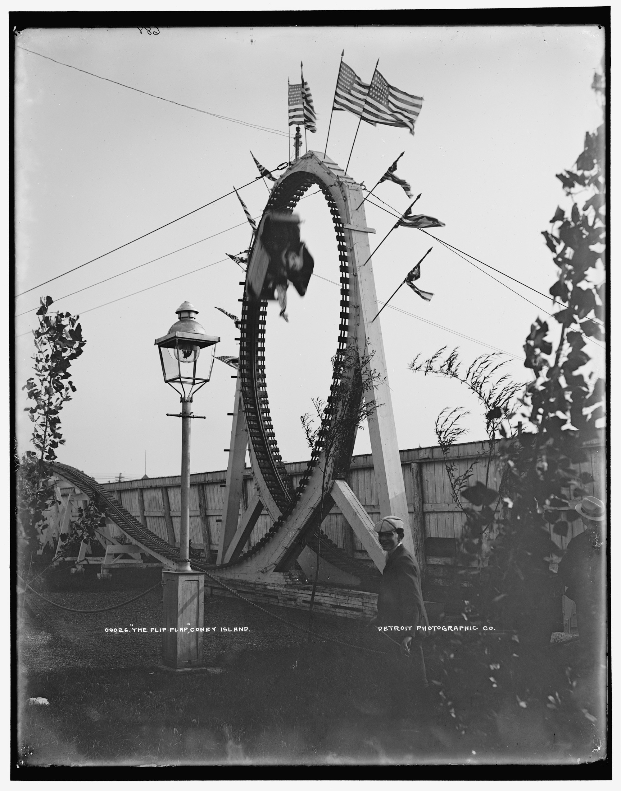
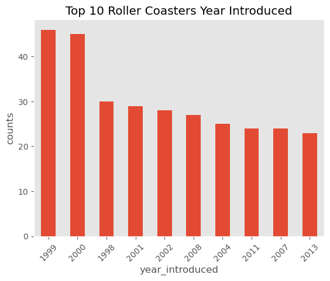

# 🎢Rollar Coaster Analysis:ß



# 🙏 Introduction

- The roller coaster dataset offers a comprehensive overview of various roller coasters from different amusement parks worldwide. This dataset includes information such as the coaster names, manufacturers, types, locations, and current operating statuses. It is a valuable resource for analyzing the characteristics and trends within the roller coaster industry.
- The primary objective of this analysis is to predict the operating status of roller coasters using various features present in the dataset. By understanding the factors that contribute to a coaster’s status as “Operating” or not, we can gain insights into the operational trends and possibly the longevity and success of different types of roller coasters.

# 🤝Ask

- **Handling Missing Values:** Missing values in the Status column were filled with “Closed” to ensure completeness.
- **Encoding Status:** The Status column was transformed into a binary format, with 1 representing “Operating” and 0 representing any other status.
- **Feature Engineering:** The type_main column was one-hot encoded to convert categorical data into numerical data, facilitating the use of machine learning algorithms.
- **Data Standardization:** Features were standardized to have zero mean and unit variance, which is crucial for algorithms like k-Nearest Neighbors (k-NN) that rely on distance calculations.

# ⚙️Tools Used

The following tools and libraries were utilized in this analysis:

1. **Pandas**: For data manipulation and preprocessing. Pandas is essential for handling missing values, encoding categorical variables, and preparing the dataset for machine learning models.

2. **NumPy**: For numerical operations and handling arrays. NumPy complements Pandas in efficiently performing mathematical and logical operations on large datasets.

3. **Scikit-Learn**: For machine learning algorithms and model evaluation. Scikit-Learn provides a wide range of tools, including:

   - **StandardScaler**: For standardizing the features.
   - **LabelEncoder**: For encoding categorical variables.
   - **train_test_split**: For splitting the data into training and testing sets.
   - **KNeighborsClassifier**: For implementing the k-Nearest Neighbors algorithm.
   - **accuracy_score**, **confusion_matrix**, **classification_report**: For evaluating the model's performance.

4. **Matplotlib**: For data visualization. Matplotlib is used to create plots and graphs that help in understanding the distribution of the data and the results of the analysis.

5. **Jupyter Notebook**: For interactive data analysis and visualization. Jupyter Notebook allows for combining code, visualizations, and narrative text in a single document, facilitating better understanding and communication of the analysis process.

# 📊EDA

```py
import pandas as pd
import numpy as np
import matplotlib.pyplot as plt
import seaborn as sns
plt.style.use('ggplot')
df = pd.read_csv('/Users/saquibhazari/Desktop/Python/roller_coaster/CSV/Assets/coaster_db.csv')
```

### Visualizing:

```py
# Visualizing the dataset
df['year_introduced'].value_counts().sort_values(ascending=False).head(10) \
      .plot(kind='bar', ylabel='counts', grid=False)
plt.title('Top 10 Roller Coasters Year Introduced')
plt.xticks(rotation=45)
plt.show()
```



```py
# comparing the seed of the coasters
from matplotlib.ticker import FuncFormatter
df['speed_mph'].plot(kind='hist', bins=20, grid=False, edgecolor='white', xlabel='Speed_mph')
plt.title('Speed of the rollar coasters')
plt.tight_layout()
ax = plt.gca()
ax.xaxis.set_major_formatter(plt.FuncFormatter(lambda x, pos: f"{int(x/1)}mph"))
plt.show()
```


```py
# Making a Kde plot for the speed
df['speed_mph'].plot(kind='kde', grid=False)
plt.title('Speed of rollar coasters.')
plt.xlabel('speed_mph')
ax = plt.gca()
ax.xaxis.set_major_formatter(plt.FuncFormatter(lambda x, pos: f"{int(x/1)}mph"))
plt.tight_layout()
plt.show()
```


```py
# Making a Scatter plot between speed and height using seaborn and matplotlib
df.plot(x='speed_mph', y='height_ft', kind='scatter', title='Speed vs Height of coasters')
plt.xlabel('speed_mph')
plt.ylabel('height_ft')
plt.tight_layout()
plt.show()
```


```py
# Making a Scatter plot between speed and height using seaborn and matplotlib
sns.scatterplot(x='speed_mph', y='height_ft',data=df, hue='year_introduced')
plt.title('Speed vs Height of coasters.')
plt.xlabel('speed_mph')
plt.ylabel('height_ft')
plt.tight_layout()
plt.show()
```


```py
df_corr = df.drop(['coaster_name', 'location', 'status', 'manufacturer', 'type_main'],axis=1).corr()
sns.heatmap(data=df_corr, annot=True, cbar=False)
plt.title('Heat map for all the corr.')
```


```py
# Making a pair plot for the corr
sns.pairplot(data=df, vars=['year_introduced', 'speed_mph', 'height_ft', 'gforce_clean', 'inversions_clean'], hue='type_main')
plt.title('Pair Plot')
plt.tight_layout()
plt.show()
```


```py
# Finally finding the top most speed rollar coaster acc to the locations.
df.query("location != 'other'").groupby('location')['speed_mph'] \
      .agg(['mean', 'count']).query("count > 10").sort_values('mean')['mean'] \
      .plot(kind='barh', figsize=(10,5), title='Speed of coaster acc to locations.', xlabel='Speed_mph', ylabel='Locations', grid=False)
ax = plt.gca()
ax.xaxis.set_major_formatter(plt.FuncFormatter(lambda x, pos: f"{int(x/1)}mph"))
plt.tight_layout()
plt.show()
```


# 🧩Linear Regression

```py
X = df[['year_introduced', 'inversions_clean', 'gforce_clean', 'type_main']]
y = df['speed_mph']
X = pd.get_dummies(X, columns=['type_main'], drop_first=True)
X_train, X_test, y_train, y_test = train_test_split(X, y, test_size=0.2, random_state=42)
model = LinearRegression()
model.fit(X_train, y_train)
model.coef_
model.intercept_
predictions = model.predict(X_test)
print('MAE', mean_absolute_error(y_test, predictions))
```


# 📚Logistic Regression

```py
from sklearn.linear_model import LogisticRegression
from sklearn.metrics import classification_report, confusion_matrix

X = df.drop(['coaster_name', 'manufacturer', 'location', 'status'], axis=1)
y = df['status'].apply(lambda x: 1 if x == 'Operating' else 0)
X = pd.get_dummies(X, columns=['type_main'], drop_first=True)

X_train, X_test, y_train, y_test = train_test_split(X, y, test_size=0.2, random_state=42)

lg_model = LogisticRegression()
lg_model.fit(X_train, y_train)
lg_model.coef_
pred_lg = lg_model.predict(X_test)
print(classification_report(y_test, pred_lg))
print('\n')
print(confusion_matrix(y_test, pred_lg))
```


# ♻︎Randomforest Model

```py
# Using Randomforest model
from sklearn.ensemble import RandomForestClassifier

rn_model = RandomForestClassifier(n_estimators=100)

rn_model.fit(X_train, y_train)
rn_pred = rn_model.predict(X_test)

print(classification_report(y_test, rn_pred))
print('\n')
print(confusion_matrix(y_test, rn_pred))
```


# ✅ Conculsion:

This project involved extensive practice in modeling, feature engineering, and data preprocessing. The following key techniques and methodologies were applied:

1. **Data Cleaning and Preprocessing**: The dataset underwent thorough cleaning, including handling missing values, encoding categorical variables, and standardizing numerical features. This step ensured the data was in a suitable format for analysis and modeling.

2. **Exploratory Data Analysis (EDA)**: EDA was conducted to understand the distribution of the data, identify patterns, and visualize relationships between variables. Various plots and graphs provided insights into the characteristics of the roller coasters.

3. **Feature Engineering**: New features were created, and existing ones were transformed to improve the performance of the models. This included encoding categorical variables and generating dummy variables for machine learning algorithms.

4. **Modeling**: Several machine learning models were built and evaluated:

   - **Linear Regression**: Used for predicting continuous variables, although not directly applied to this categorical target problem, it was part of the learning process.
   - **Logistic Regression**: Applied to predict the operational status of roller coasters (a binary classification problem).
   - **Random Forest**: Used for its robustness and ability to handle complex datasets, providing feature importance insights and accurate predictions.

5. **Evaluation and Visualization**: The models were evaluated using various metrics such as accuracy, confusion matrix, and classification report. Visualizations were created to illustrate the results and performance of the models.

Overall, this project successfully demonstrated how to clean and preprocess data, handle missing values, and conduct effective modeling with EDA and visualization. The insights gained from this analysis and the models built provide a solid foundation for further exploration and application of machine learning techniques.
